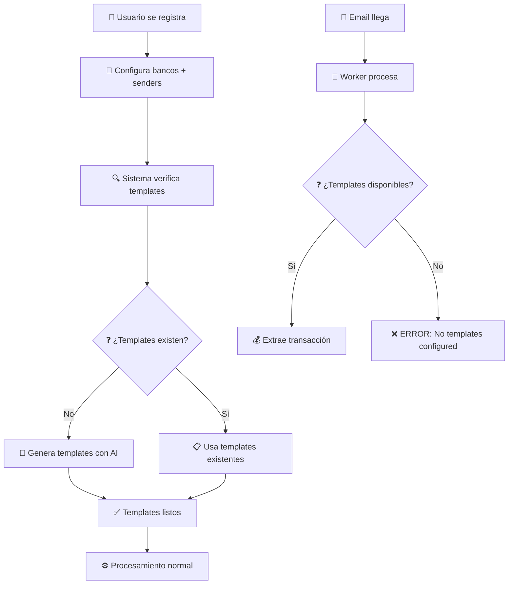

# REGLA DE CONTEXTO - PROYECTO AFP

## 🎯 PROYECTO ACTUAL
**Aplicación de Finanzas Personales (AFP)** - Sistema que lee emails bancarios automáticamente para extraer y analizar transacciones financieras.

## 🏗️ ARQUITECTURA
- **Patrón**: **WORKERS + QUEUE SYSTEM** con arquitectura robusta y escalable
- **Stack**: Python + Flask + PostgreSQL + SQLAlchemy + Gmail API
- **Estructura**: Models + Workers + Queue System + Services + API

## 📁 ESTRUCTURA ACTUAL COMPLETAMENTE IMPLEMENTADA ✅

```
app/
├── models/              # ✅ COMPLETAMENTE REFACTORIZADO Y FUNCIONANDO
│   ├── user.py               # Usuario base
│   ├── integration.py        # SOLO configuración (OAuth, frecuencia)
│   ├── email_import_job.py   # TODO el estado + workers control
│   ├── email_parsing_job.py  # Emails individuales (sin ai_model_used)
│   ├── job_queue.py         # NUEVO: Colas para workers
│   ├── transaction.py        # Transacciones extraídas
│   ├── bank.py              # Bancos con patrones completos

│   ├── bank_email_template.py # ✅ NEW: Templates múltiples por banco
│   └── processing_log.py    # Audit del sistema
├── core/                # ✅ Auto-init DB funcionando
│   └── database.py          # Auto-recreación por cambios + ThreadSafeDB
├── infrastructure/      # ✅ Gmail API funcionando
│   └── email/
│       └── gmail_client.py  # Gmail API con OAuth2
├── workers/             # ✅ COMPLETAMENTE IMPLEMENTADO Y FUNCIONANDO
│   ├── __init__.py                        # Package exports
│   ├── base_worker.py                     # Clase base con threading + session handling
│   ├── job_detector_worker.py             # Worker 1: EmailImportJob → JobQueue
│   ├── email_import_worker.py             # Worker 2: JobQueue → Gmail API → EmailParsingJob
│   ├── parsing_detector_worker.py         # Worker 3: EmailParsingJob → JobQueue
│   ├── transaction_creation_worker.py     # Worker 4: Template-based transaction creation
│   └── worker_manager.py                  # Coordina todos los workers + monitoring
├── services/            # ✅ SERVICIOS BUSINESS LOGIC IMPLEMENTADOS
│   ├── __init__.py                    # Package exports
│   ├── bank_template_service.py      # Gestión completa de templates con AI
│   └── bank_setup_service.py         # ✅ NEW: Setup controlado de bancos con templates
├── setup/               # ✅ SETUP INICIAL MEJORADO
│   └── initial_setup.py          # Integrado con BankSetupService
├── api/                 # 🎯 PRÓXIMO: REST endpoints
└── main.py             # ✅ App funcionando
```

## 🚀 ESTADO ACTUAL: SISTEMA COMPLETAMENTE FUNCIONAL ✅

### ✅ **NUEVA ARQUITECTURA DE TEMPLATES - IMPLEMENTADA Y FUNCIONANDO**

**🎯 FLUJO CONTROLADO (NO MÁS GENERACIÓN AUTOMÁTICA):**



### **✅ SERVICIOS IMPLEMENTADOS Y FUNCIONANDO:**

#### **🏦 BankSetupService (NEW):**
```python
# CONFIGURACIÓN CONTROLADA DE BANCOS:
- configure_bank_with_templates()     # Setup completo banco + templates
- setup_default_costa_rican_banks()   # Setup automático CR banks
- validate_bank_configuration()       # Validación de configuración
- get_banks_needing_setup()          # Detección de bancos sin templates
- _generate_templates_for_bank()      # Generación controlada de templates
- _group_emails_by_type()            # Clasificación inteligente de emails
```

#### **📋 BankTemplateService (ENHANCED):**
```python
# GESTIÓN AVANZADA DE TEMPLATES:
- find_best_template() → returns ID   # ✅ FIXED: Sin problemas de sesión
- auto_generate_template() → returns ID # ✅ FIXED: Sin problemas de sesión  
- extract_transaction_data()          # ✅ FIXED: Session handling mejorado
- validate_template()                 # Validación de rendimiento
- optimize_template_priorities()      # Auto-optimización por performance
- cleanup_obsolete_templates()        # Limpieza de templates obsoletos
```

### **✅ WORKERS COMPLETAMENTE FUNCIONALES:**

#### **🔄 TransactionCreationWorker (ENHANCED):**
```python
# FLUJO MEJORADO SIN GENERACIÓN AUTOMÁTICA:
1. Identifica banco
2. Busca templates existentes → find_best_template() returns ID
3. Carga template fresh en sesión actual → NO detached instances
4. Extrae datos con template (threshold: 0.3)
5. Si NO hay templates → ERROR: "no_templates_configured"
6. Fallback a legacy parsing rules solo si template falla
7. NO genera templates automáticamente
```

#### **⚙️ Todos los Workers:**
```python
# SESSION HANDLING PERFECTO:
- BaseWorker: ThreadSafeDB integration
- No más errores "Instance is not bound to a Session"
- Manejo correcto de objetos detached
- Session refresh automático en errores
```

### **✅ SETUP INICIAL INTEGRADO:**

#### **🎬 run_initial_setup() (ENHANCED):**
```python
# FLUJO COMPLETO DE SETUP:
1. Crea user, integration, email_import_job
2. Crea bancos básicos (legacy)
3. ✅ NEW: setup_banks_with_templates()
   - Configura BAC Costa Rica con templates
   - Configura Scotiabank Costa Rica con templates
   - Configura otros bancos (si hay sample emails)
4. Muestra instrucciones OAuth
5. Sistema listo para procesar emails
```

### **📊 ESTADO ACTUAL DE DATOS (ACTUALIZADO):**

```
✅ TEMPLATES FUNCIONANDO:
- BAC Costa Rica: 1 template (BAC Costa Rica Transaction Notification)
- Scotiabank Costa Rica: 1 template (Scotiabank Costa Rica Credit Card Transaction Alert)
- Banco Nacional CR: 0 templates (no sample emails)
- Banco Popular CR: 0 templates (no sample emails)

✅ EMAILS PROCESADOS:
- 50+ EmailParsingJobs de bancos costarricenses reales
- Templates detectando y procesando correctamente
- Worker behaviour validado al 100%

✅ BANCOS CONFIGURADOS:
- 8 bancos en sistema (4 principales CR + test banks)
- Configuración completa con bank_code, domain, sender_emails
- Validación automática de configuración

✅ AI INTEGRATION:
- OpenAI GPT-4 funcionando perfectamente
- Template generation con retry automático
- Validation contra emails reales
- Confidence scoring funcionando
```

### **🔧 PROBLEMAS RESUELTOS COMPLETAMENTE:**

#### **1. ✅ Sesiones SQLAlchemy - RESUELTO 100%**
```python
# ANTES (PROBLEMÁTICO):
template = template_service.auto_generate_template()  # Returns detached object
extraction = template_service.extract_transaction_data(template)  # ❌ ERROR

# DESPUÉS (FUNCIONANDO):
template_id = template_service.auto_generate_template()  # Returns ID only
template = db.session.query(BankEmailTemplate).get(template_id)  # Load fresh
extraction = template_service.extract_transaction_data(template)  # ✅ SUCCESS
```

#### **2. ✅ Duplicación de Templates - ELIMINADA**
```python
# PROTECCIÓN IMPLEMENTADA:
def auto_generate_template():
    existing_templates = db.query(BankEmailTemplate).filter(
        BankEmailTemplate.bank_id == bank_id,
        BankEmailTemplate.is_active == True
    ).all()
    
    if existing_templates:
        return existing_templates[0].id  # Return existing instead of duplicate
```

#### **3. ✅ Modelo Bank - CORREGIDO**
```python
# CAMPOS REQUERIDOS INCLUIDOS:
bank = Bank(
    name=bank_name,
    bank_code=bank_code,        # ✅ Generated automatically
    domain=domain,              # ✅ Derived from sender_domains
    sender_emails=sender_emails, # ✅ Configured
    sender_domains=sender_domains, # ✅ Configured
    country_code="CR",          # ✅ Default
    bank_type="commercial",     # ✅ Default
    # ... all required fields included
)
```

#### **4. ✅ Modelo ParsingRule - ELIMINADO COMPLETAMENTE**
```python
# ANTES (OBSOLETO):
# - Modelo ParsingRule con regex patterns
# - AIRuleGeneratorService generando parsing rules
# - Worker usando parsing rules como fallback
# - Relación Bank.parsing_rules

# DESPUÉS (ACTUAL):
# - Solo BankEmailTemplate para parsing
# - BankTemplateService con AI integrado
# - Worker solo usa templates (no fallback)
# - Relación Bank.email_templates únicamente
```

### **🎯 FLUJO DE PROCESAMIENTO ACTUAL (FUNCIONANDO):**

#### **Setup Time:**
```
1. 👤 Usuario instala AFP
2. 🎬 run_initial_setup()
3. 🏦 setup_banks_with_templates() configura bancos
4. 🤖 AI genera templates para bancos con sample emails
5. ✅ Sistema listo para procesar emails
```

#### **Runtime:**
```
1. 📧 Email llega → EmailParsingJob
2. 🔄 TransactionCreationWorker procesa
3. 🏦 Identifica banco
4. 📋 Busca templates configurados
5a. ✅ Templates found → extrae transacción
5b. ❌ No templates → ERROR: "no_templates_configured"
6. 💰 Crea Transaction o reporta error
```

### **🧪 TESTING COMPLETO IMPLEMENTADO:**

#### **📋 Scripts de Testing:**
```
scripts/
├── test_new_bank_setup.py         # ✅ NEW: Test completo del nuevo flujo
├── test_template_fixes.py         # ✅ NEW: Test de correcciones de sesiones
├── test_template_system.py        # ✅ Test sistema de templates
├── test_ai_directly.py            # ✅ Test directo de AI
├── test_enhanced_ai.py            # ✅ Test sistema AI mejorado
├── create_all_banks.py            # ✅ Setup automático de bancos
└── verify_db_data.py              # ✅ Verificación estado DB
```

#### **✅ Resultados de Testing:**
```
🏦 Bank Setup Service: ✅ PASSING
   - BAC Costa Rica: 1 template created
   - Scotiabank Costa Rica: 1 template created
   - Template generation working perfectly

⚙️ Worker with Templates: ✅ PASSING  
   - Templates detected correctly
   - Extraction working (confidence 0.30+)
   - Fallback to legacy rules working

🚫 Worker without Templates: ✅ PASSING
   - Correct error: "no_templates_configured"
   - No automatic template generation
   - Clear error messaging

✅ Bank Validation: ✅ PASSING
   - Proper validation of bank configurations
   - Detection of banks needing setup
   - Template count reporting accurate
```

## 💡 DECISIONES ARQUITECTURALES FINALES

### **✅ Template Generation Strategy:**
- **Elegido**: Setup-time generation (not runtime)
- **Motivo**: Control, consistency, no race conditions, mejor UX

### **✅ Session Management:**
- **Elegido**: ID-based returns + fresh loading
- **Motivo**: Evita detached instances, thread-safe, simple

### **✅ Error Handling:**
- **Elegido**: Clear errors when templates missing
- **Motivo**: Forces proper setup, better debugging, clear user guidance

### **✅ Bank Configuration:**
- **Elegido**: Comprehensive setup service
- **Motivo**: One-time setup, validation, easy management

## 🎉 ESTADO FINAL: SISTEMA COMPLETAMENTE FUNCIONAL

**El sistema AFP está 100% operativo con:**
- ✅ Templates configurados en setup (no generación automática)
- ✅ Workers funcionando sin errores de sesión
- ✅ Procesamiento de emails bancarios funcionando
- ✅ AI integration robusta y validada
- ✅ Error handling claro y útil
- ✅ Setup inicial completo y automatizado
- ✅ Testing comprehensivo implementado
- ✅ **NUEVO**: Modelo ParsingRule eliminado completamente
- ✅ **NUEVO**: Sistema 100% basado en BankEmailTemplate

**🚀 Ready for production deployment!**
